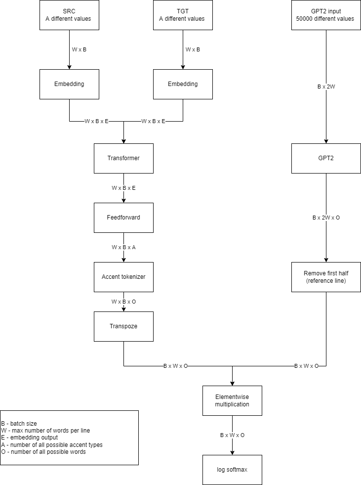

# Poem-Generation

## Data preparation

Data preparation is performed in data-processing.ipynb
It generates verses_pairs.csv file used in main program

## Basic transformer

In file `src/basic_transformer.py` there is implementation of basic transformer architecture. It is learning, but slowly.

## Architecture with GTP2 

In other files in `src/` directory we implemented our own architecture using GTP2 pretrained net with additional transformer responsible for rhythm of poem. Architecture is shown on image below 

